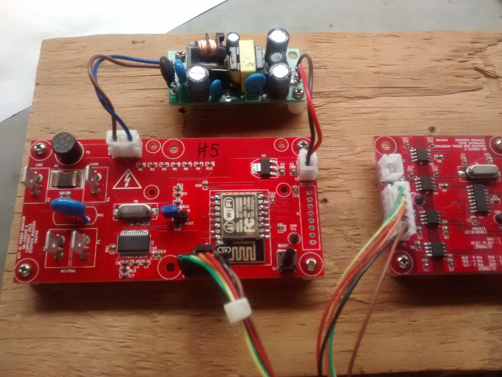
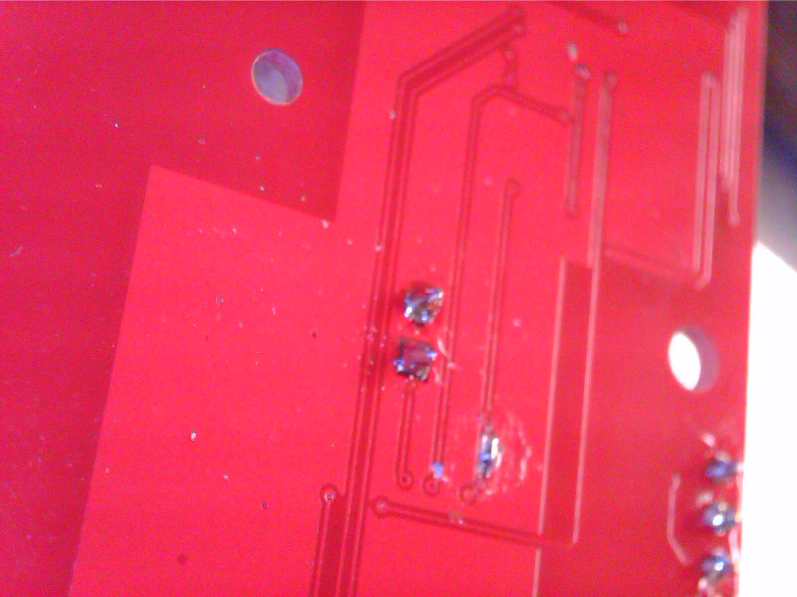

** HW-AC-Emeter **
==========
This is the hardware implementation for my Atmel 90E24 power line monitor project. The Atmel 90E24 is a complete energy management solution on a chip. It allows
voltage, current, true power, apparent power, reactive power, power factor, phase angle, and line frequency to be accurately measured. Additionally it can measure
energy and with firmware, you can convert the energy pulses into kilowatt hours.

**Features:**

This board contains an ESP12 module, and an Atmel 90E24 Energy monitor chip.
The board can be powered from any floating voltage source from 5V to 12V. You can optionally stuff an ESP8266 or an 8 pin connector for use with an AVR (Arduino board) or other
microprocessor which has 3 free GPIO pins. The board partially shown on the far right is used to isolate the serial data signals from the ESP8266 from mains potential to protect your computer (see NB below).
I have a separate project on Github for the [isolated USB serial port](http://github.com/hwstar/ISO-Port) 

The board is inserted into a the live (phase) and neutral leads going to a a load which runs on mains voltages.

There is a 1 milliohm current shunt on the live  side of the connections. This allows up to 24 amps to be measured.

NB: See the disclaimer below. This project is not for beginners. THE LOGIC GROUND FOR THE ATMEL 90E24 IS CONNECTED DIRECTLY TO THE AC LIVE LEAD. This means you must heed the following warnings:

1. If you want to use test equipment on this project, an isolation transformer with floating live and neutral leads is ABSOLUTELY REQUIRED if
you want to keep your scope or other grounded test equipment from being BLOWN UP. 

2. The SPI signals going to your microprocessor are not isolated from mains so your whole system will
be at line potential. Hooking these up to something which is not floating WILL cause everything connected to be DESTROYED.

3. The RS-232 signals on the ESP8266 version are also not isolated and are at line potential. It is recommended to use an isolated USB RS-232 interface to prevent your computer
from being BLOWN UP.

4. The power supply for Atmel 90E24 must be floating. Do not use your lab power supply or any other power supply which is not floating. Use an ungrounded 5 volt wall wart for testing.

**EDA Software**

This board was designed using KICAD. 

**Calibration**

This is the challenging part. I took some shortcuts and cut some corners. Read the 90E24 data sheet about how to go about this correctly. You need to have some way of presenting known AC loads to the unit, and correlating the results seen in the registers. I used a 60 watt bulb as a resistive load,
and a variac and shaded pole motor as a reactive load. This is really far from ideal as your wall socket mains voltage will vary enough to make the effort challenging and error-prone. If you have access to a stable AC power
source (K$) and precision resistive and reactive AC loads (K$), then the calibration will be much easier. The firmware will save calibration  values to non volatile memory. 

**Board Size**

5cm x 10cm

**Some Rework Required on rev X1 board blanks**

Rev X1 boards will require rework to connect the ~CS line to logic ground the 90E24 and open the ~CS and IRQ lines to the ESP8266.  My ESP8266 devices want to force GPIO5 high
and this prevents the line from being used as a chip select. For use with the AVR firmware, ~CS must also be connected to logic ground. 
This can be accomplished by scraping away the ground soldermask and bridging ground to the ~CS line.

If there is enough interest, I'll spin a rev A board blank. The X1 blanks are useable even though they have a bodge on the bottom side of the board.

Rework picture:

1. The cut on the left is the IRQ line
2. The cut and solder bridge on the right is the ~CS line.

**Firmware**

The AVR firmware for this project can be found [here](https://github.com/hwstar/FW-AC-Emeter)
The ESP8266 firmware for this project can be found [here](https://github.com/hwstar/FW-AC-Emeter-ESP8266)

**LICENSE**

Creative Commons Attribution Share-Alike license. (CC-BY-SA)

**Disclaimer**

Build and use at your own risk. This board uses potentially lethal mains voltages. 

I will not be responsible for any damages including but not limited to: errors or omissions, loss of life, or property damage. You have been warned.

